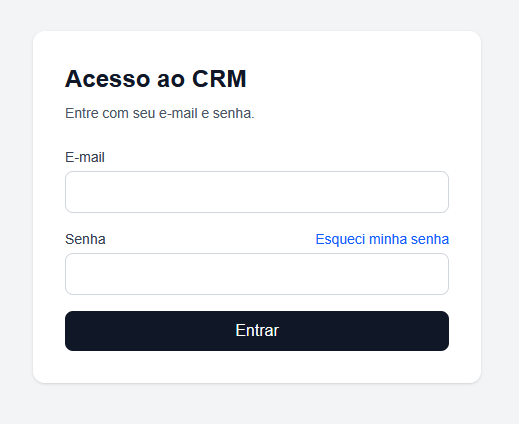
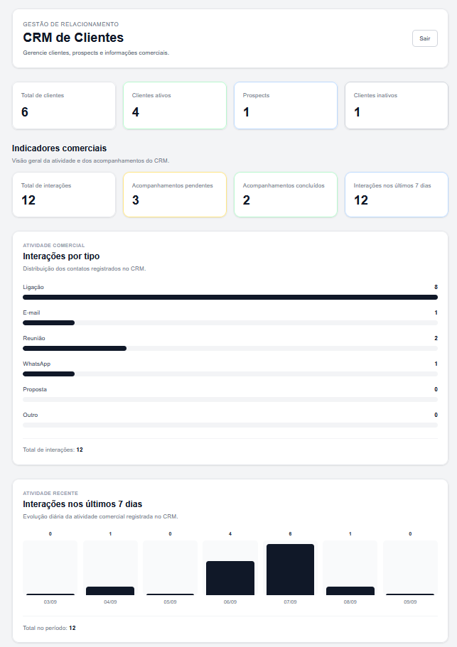
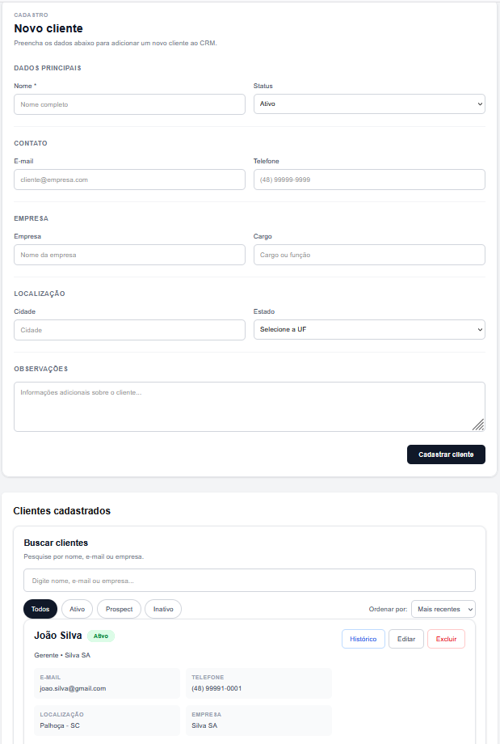

# CRM de Clientes

Aplicação web para gerenciamento de clientes desenvolvida com **Next.js, TypeScript e Supabase**, utilizando autenticação, banco de dados PostgreSQL, Row Level Security (RLS) e deploy contínuo na Vercel.

O projeto foi desenvolvido como aplicação prática e também como parte do meu portfólio em desenvolvimento web, integração de sistemas e banco de dados.

## 🌐 Aplicação publicada

**Demo:** https://crm-clientes-thomas.vercel.app

> O acesso ao CRM é protegido por autenticação. Usuários precisam estar previamente cadastrados para acessar a aplicação.

## 📸 Screenshots

### Login



### Dashboard



### Gerenciamento de clientes



## 📌 Sobre o projeto

O CRM permite realizar o gerenciamento básico de clientes através de uma interface web integrada ao Supabase.

A aplicação implementa operações CRUD completas, autenticação de usuários, proteção de rotas, pesquisa, filtros e indicadores para acompanhamento dos registros.

## ✨ Funcionalidades

- Autenticação de usuários
- Cadastro, edição e exclusão de clientes
- Busca e filtros por status
- Dashboard com indicadores de clientes
- Histórico de interações por cliente
- Timeline de interações
- Tipos de interação: ligação, e-mail, reunião, WhatsApp, proposta e outros
- Agendamento de próximo contato
- Identificação automática de acompanhamentos atrasados
- Conclusão de acompanhamentos
- Dashboard de próximos contatos e atrasos
- Indicadores comerciais
- Interações por tipo
- Interações nos últimos 7 dias
- Atualização automática dos dashboards

## 🛠️ Tecnologias utilizadas

### Front-end

- Next.js 16
- React
- TypeScript
- Tailwind CSS

### Back-end e banco de dados

- Supabase
- PostgreSQL
- Supabase Auth
- Row Level Security (RLS)

### Infraestrutura e desenvolvimento

- Node.js
- npm
- Git
- GitHub
- Vercel
- Visual Studio Code

## 🏗️ Arquitetura

A aplicação utiliza uma arquitetura baseada em serviços:

```text
Usuário
   │
   ▼
Next.js / React
   │
   ├── Autenticação
   │        │
   │        ▼
   │   Supabase Auth
   │
   └── CRUD de clientes
            │
            ▼
       Supabase API
            │
            ▼
       PostgreSQL
            │
            ▼
            RLS
```

O Next.js é responsável pela interface e lógica da aplicação, enquanto o Supabase fornece autenticação, API e persistência dos dados em PostgreSQL.

## 🔐 Segurança

O projeto utiliza diferentes camadas de proteção.

### Autenticação

O acesso ao CRM exige autenticação através do Supabase Auth.

### Proteção de rotas

Rotas privadas são protegidas no Next.js. Usuários não autenticados são redirecionados automaticamente para a tela de login.

### Row Level Security

A tabela de clientes utiliza **Row Level Security (RLS)** no PostgreSQL/Supabase.

As políticas permitem operações de leitura e escrita somente para usuários autenticados.

### Variáveis de ambiente

Credenciais e configurações específicas do ambiente não são armazenadas diretamente no repositório.

O projeto utiliza:

```env
NEXT_PUBLIC_SUPABASE_URL=
NEXT_PUBLIC_SUPABASE_PUBLISHABLE_KEY=
```

O arquivo `.env.local` permanece fora do controle de versão.

O repositório fornece apenas `.env.example` como referência de configuração.

## 📂 Estrutura do projeto

Estrutura simplificada:

```text
crm-clientes-nextjs-supabase/
│
├── app/
│   ├── login/
│   │   └── page.tsx
│   ├── globals.css
│   ├── layout.tsx
│   └── page.tsx
│
├── components/
│   ├── auth/
│   │   └── BotaoSair.tsx
│   └── clientes/
│       ├── FormCliente.tsx
│       ├── ListaClientes.tsx
│       └── ResumoClientes.tsx
│
├── lib/
│   └── supabase/
│       └── client.ts
│
├── public/
│
├── .env.example
├── proxy.ts
├── package.json
└── README.md
```

## 🚀 Executando localmente

### 1. Clone o repositório

```bash
git clone https://github.com/thomasbobadilla/crm-clientes-nextjs-supabase.git
```

### 2. Entre no diretório

```bash
cd crm-clientes-nextjs-supabase
```

### 3. Instale as dependências

```bash
npm install
```

### 4. Configure as variáveis de ambiente

Crie um arquivo:

```text
.env.local
```

Utilizando `.env.example` como referência:

```env
NEXT_PUBLIC_SUPABASE_URL=SEU_PROJECT_URL
NEXT_PUBLIC_SUPABASE_PUBLISHABLE_KEY=SUA_PUBLISHABLE_KEY
```

### 5. Execute o projeto

```bash
npm run dev
```

A aplicação estará disponível normalmente em:

```text
http://localhost:3000
```

## ☁️ Deploy

O projeto está hospedado na **Vercel** e integrado ao repositório GitHub.

Alterações enviadas para a branch principal podem gerar automaticamente uma nova versão da aplicação em produção.

**Produção:**  
https://crm-clientes-thomas.vercel.app

## 🧪 Validações realizadas

Durante o desenvolvimento foram testados:

- autenticação;
- proteção de rotas;
- login e logout;
- inclusão de clientes;
- alteração de clientes;
- exclusão de clientes;
- consultas ao banco;
- busca;
- filtros;
- indicadores;
- políticas RLS;
- build de produção;
- deploy na Vercel.

## 🗺️ Roadmap

Possíveis evoluções do projeto:

## 🗺️ Roadmap

- [x] Recuperação de senha
- [ ] Cadastro e gerenciamento de usuários
- [x] Paginação de clientes
- [x] Ordenação das listagens
- [x] Dashboard com novos indicadores
- [x] Histórico de interações com clientes
- [ ] Funil comercial
- [ ] Registro de oportunidades
- [ ] Exportação de dados
- [x] Melhorias de responsividade
- [ ] Testes automatizados

### V3
- API REST para integração com sistemas externos
- Webhooks
- Exportação de relatórios em PDF
- Exportação para XLSX
- Exportação para CSV
- Relatórios por cliente, período, status e interação
- Melhorias de segurança e preparação para ambiente corporativo

## 🎯 Objetivo do projeto

Além de desenvolver uma aplicação funcional, este projeto tem como objetivo demonstrar conhecimentos práticos em:

- desenvolvimento web com React e Next.js;
- TypeScript;
- integração entre front-end e serviços de back-end;
- APIs;
- banco de dados PostgreSQL;
- autenticação;
- controle de acesso;
- segurança com RLS;
- Git e GitHub;
- deploy e ambiente de produção.

<!-- Deploy automático configurado com Vercel -->

## API REST

A V3 inclui uma API REST para integração com clientes e interações.

A V3 inclui uma API REST para gerenciamento e integração de clientes e interações comerciais.

📖 [Documentação completa da API](docs/API.md)

## 👨‍💻 Autor

**Thomas Bobadilla**

Projeto desenvolvido para estudo, evolução técnica e composição de portfólio profissional.

## 📫 Contato

- E-mail: thomasbobadila@gmail.com
- LinkedIn: https://www.linkedin.com/in/tmbobadilla/
- GitHub: https://github.com/thomasbobadilla
